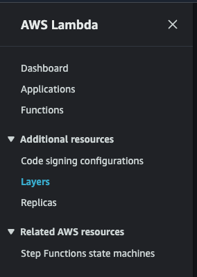
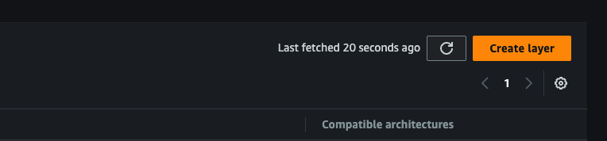
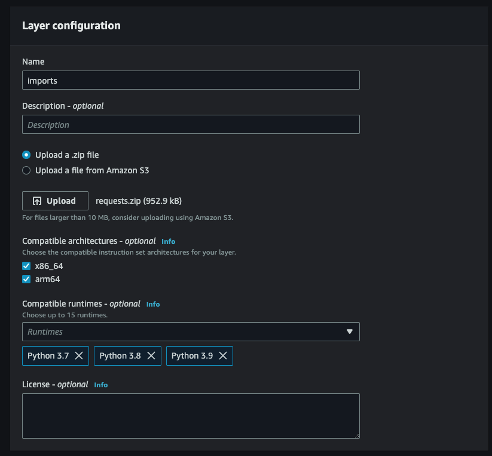
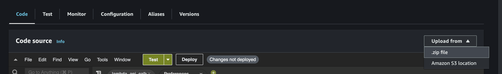
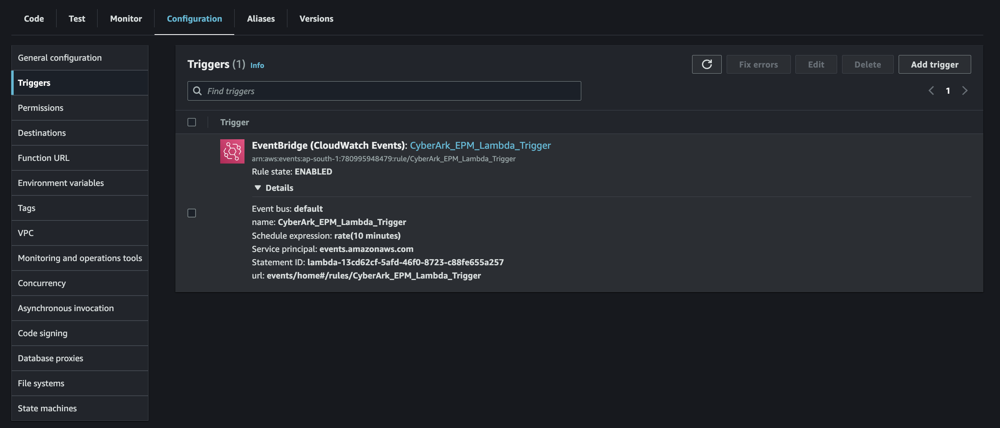

# CyberArk EPM

# Pre-requisites

1. Permission for creating AWS IAM roles and policies
2. Permission for creating and accessing AWS Lambda
3. Permission for creating and editing AWS S3
4. Access to the API keys in Coralogix platform

## Summary

For CyberArk EPM, the integration will be done as a lambda function that interacts with the CyberArk EPM API to fetch
and ship the logs while storing the data into an S3 bucket.

## Part 1: Importing Packages as Layer

1. Navigate to `Layers`

   

2. Click on `Create layer`

   

3. Fill the fields accordingly and upload the `.zip`
   from [here](https://github.com/nir-limor-coralogix/client-integrations/raw/main/SIEM/CyberArk%20EPM/Layer/requests.zip)

   

## Part 2: Deploying Lambda

1. Set up a new S3 bucket dedicated only for CyberArk EPM logs
2. Create a basic lambda function using the S3 bucket created above
3. Copy the code
   from [here](https://raw.githubusercontent.com/nir-limor-coralogix/client-integrations/main/SIEM/CyberArk%20EPM/Code/lambda_api_calls.py?token=GHSAT0AAAAAAB2WC7Z7WG33VZHXS3N6ENWIZCJBHYQ)
   and `Deploy` the changes made to the file

   

4. Choose the Edit runtime management configuration accordingly

   

5. Navigate to the IAM Policy and create an inline policy using the one given below:

```json
{
  "Version": "2012-10-17",
  "Statement": [
    {
      "Sid": "VisualEditor0",
      "Effect": "Allow",
      "Action": [
        "s3:PutObject",
        "s3:GetObject"
      ],
      "Resource": "arn:aws:s3:::<S3 BUCKET NAME>/*"
    },
    {
      "Sid": "VisualEditor1",
      "Effect": "Allow",
      "Action": "s3:ListBucket",
      "Resource": "arn:aws:s3:::<S3 BUCKET NAME>"
    }
  ]
}
```

1. Navigate to `Configuration` > `Environment variables`
2. Set up the environment variables

| Environment Variables | Description                                                                               |
|-----------------------|-------------------------------------------------------------------------------------------|
| APPLICATIONID         | Application ID for CyberArk EPM                                                           |
| BUCKETNAME            | S3 bucket where the logs get stored                                                       |
| CHOICE_SETID          | ‘None’ to test all or provide a valid Set ID from CyberArk EPM                            |
| EPM_SERVER            | Provide the CyberArk EPM Server                                                           |
| PASSWORD              | CyberArk EPM password                                                                     |
| USERNAME              | CyberArk EPM username                                                                     |
| CX_APP_NAME           | Coralogix application name                                                                |
| CX_ENDPOINT           | Coralogix API endpoint (https://coralogix.com/docs/coralogix-rest-api-logs/#endpoint-url) |
| CX_PRIVATE_KEY        | Coralogix send your data private key                                                      |
| CX_SUB_NAME           | Coralogix subsystem name                                                                  |

## Part 3: Add import layer to lambda

1. Navigate to `Add a layer`

   

2. Choose the `Custom layers` option and add the correct version to it

   

## Part 4: Setup EventBridge trigger


